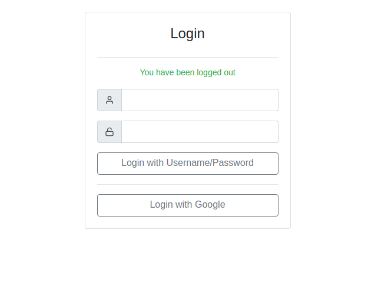

= Admin Proxy Portal

== General

This project can be used as a reverse proxy before various
services such as:

* Grafana
* Spring Boot Amin
* Kibana
* Prometheus
* Kafka Manager
* Zipkin

The UIs of these services are made available via a common URL
and unified authentication is made for them (as some of these tools
do not offer authentication on their own).

Admin Proxy Portal provides its own iframe-based UI to switch 
between the backend services.

== Limitations

* Having multiple backend UIs open in tabs is not supported, 
  since opening up one UI causes all requests to be switched to 
  this service.

* Only use Admin Proxy Portal if you control and trust all backend
  services, as Cookies from one service are also forwarded to the others.

* Using a context path (e.g. `https://example.com/admin-proxy-portal`) is not supported, it must be run
  with its own IP address / DNS name.

== Running and Configuration

Admin Proxy Portal can be launched via Docker:

....
docker run --rm ... (TODO)
....

Here is an example of the application.yml file:

[source,yaml]
....

admin-proxy-portal:
  destinations:
    - name: Spring Boot Admin
      url: http://10.0.0.1:8080
      icon: aperture
    - name: Prometheus
      url: http://10.0.0.2:8080
      icon: anchor
    - name: Grafana
      url: http://10.0.0.3:8080
      icon: monitor
    - name: Kibana
      url: http://10.0.0.4:8080
      icon: message-circle
  users:
    - username: admin
      password: reallysecurepassword
  valid-emails-for-oauth:
    - john.doe@example.com
    - jane.doe@example.com
  oauth:
    client-id: xxxxx.apps.googleusercontent.com
    client-secret: xxxxxx-yyyyyy
    provider: google
....

* Valid values for the `icon` property are those from https://feathericons.com/[Feather Icons]

* If the `oauth` section is omitted, OAuth2 Login is disabled.

* Valid values for the `provider` property are: `google`, `github`, `facebook`, and `okta`.

* When setting up a OAuth2 application with one of these providers, configure the following redirect URL: `https://admin-proxy-portal.example.com/\\__portal__/login/oauth2` (assuming that the application
 runs under the hostname `admin-proxy-portal.example.com`)

== Screenshots

=== Login Page

[caption="Login Page"]

=== Main View

[caption="Main View"]
image::docs/grafana.png[width=800]
