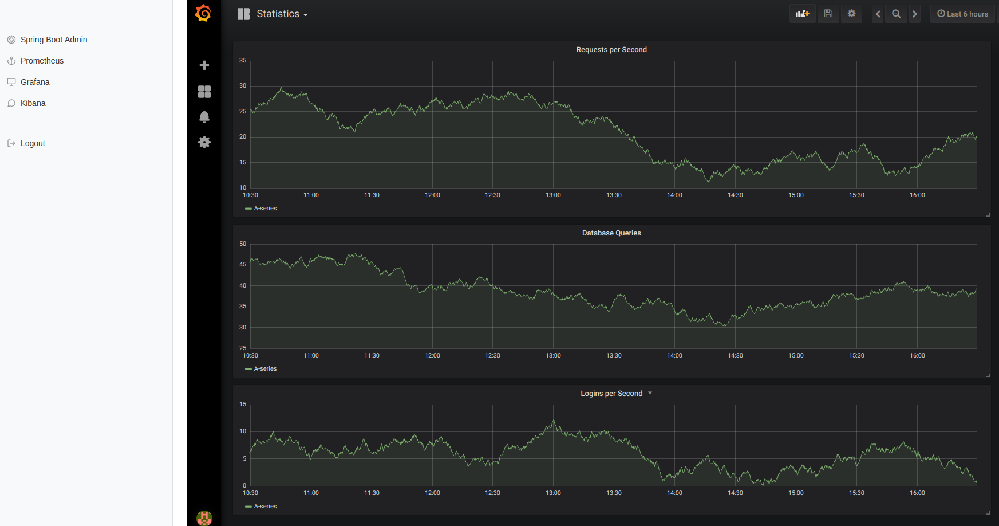

= Admin Proxy Portal

== General

This project can be used as a reverse proxy before various
services such as:

* Grafana
* Spring Boot Amin
* Kibana
* Prometheus
* Kafka Manager
* Zipkin

The UIs of these services are made available via a common URL
and unified authentication is made for them (as some of these tools
do not offer authentication on their own).

Admin Proxy Portal provides its own iframe-based UI to switch 
between the backend services.

== Limitations

* Having multiple backend UIs open in tabs is not supported, 
  since opening up one UI causes all requests to be switched to 
  this service.

* Only use Admin Proxy Portal if you control and trust all backend
  services, as Cookies from one service are also forwarded to the others.

== Running and Configuration

Admin Proxy Portal can be launched via Docker:

....
docker run --rm ...
....

== Screenshots

=== Login Page

[caption="Login Page"]

=== Main View

[caption="Main View"]

